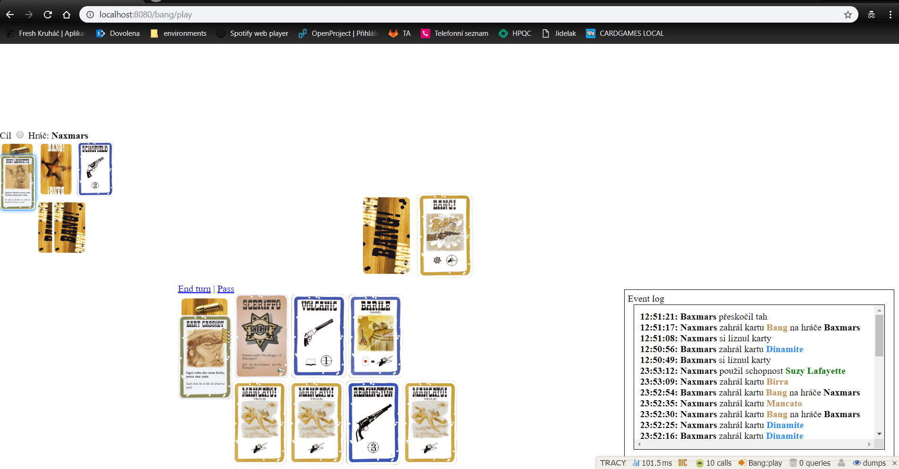

# Card games

Goal of this project is to create a social platform where players can communicate, create lobbies and play various board games.

Currently, you can play two games
  * Prší (Mau-Mau) - Card game for 2 to 5 players
  * Bang - Wild West-themed social deduction card game designed by Emiliano Sciarra

## Project Status

I realised it was a bad idea to implement platform like this using PHP and Nette. During development, I faced several issues which could be easily solved by other technologies.
Nette is not my favorite framework, and I don't desire to finish this project. Instead, I decided I will create new project and use tools better suited for this task. See [this](https://github.com/ondramastik/Bang-online) repo

## Requirements

PHP 7.3 or higher, apache server, MariaDB, Composer, Yarn

## Installation and Setup Instructions

    composer install
    cd www
    yarn install
    cd ..
    mkdir temp temp/cache log

Make directories `temp/` and `log/` writable.

## Screenshots
